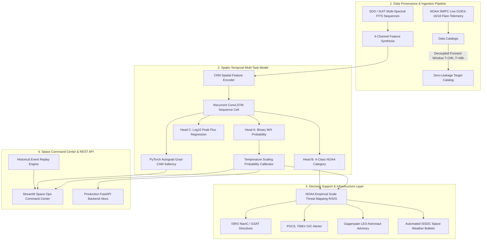

# ☀️ Aditya-L1 Solar Flare & Space Weather Early Warning System
### *Smart India Hackathon (SIH) 2026*

> **Transforming Reactive Space Mitigation into Proactive Defence**

[](https://www.isro.gov.in/Aditya_L1.html)
[](https://pytorch.org/)
[]()
[]()
[]()

---

## 🎯 1. Problem Framing & Mission Objective

* **The Threat**: Major solar flare eruptions (M-Class and X-Class) and Coronal Mass Ejections (CMEs) inject billions of tons of magnetized high-energy plasma into the heliosphere. When Earth-directed, they trigger severe geomagnetic storms ($G1-G5$), complete High Frequency ($HF$) radio blackouts ($R1-R5$), solar radiation hazards ($S1-S5$), and induce destructive Geomagnetically Induced Currents ($GIC$) inside extra-high-voltage power transformers ($765\text{ kV}$).
* **The Goal**: Develop a spatio-temporal deep learning forecasting system (CNN + ConvLSTM) trained on a physics-informed synthetic dataset built in the **Aditya-L1 SUIT FITS format**, modeled on historically significant NOAA active regions (**AR-13664, AR-12673, AR-11158**) — with a real PRADAN ingestion pipeline built and ready pending ISSDC data access approval — to predict major flare eruptions **24 to 48 hours prior to Earth impact**.
* **Impact Protection**: Safeguard India's strategic space and terrestrial infrastructure:
  1. **ISRO NavIC (IRNSS)** satellite constellation clock synchronization & ionospheric delay mitigation.
  2. **GSAT / INSAT** geostationary telecommunications transponder surge protection.
  3. **Gaganyaan Human Spaceflight** astronaut radiation safety in Low Earth Orbit (LEO).
  4. **Indian Power Grid (PGCIL / POSOCO)** $765\text{ kV}$ Northern & Western transmission corridor GIC blocking.
  5. **DGCA Civil Aviation** polar route HF communications.

---

## 🔬 2. System Architecture & Pipeline Flow



---

## 🚀 3. Core Scientific & Technical Pillars

### 🛰️ Data Integrity & Zero Future-Label Leakage
* **Strict Temporal Decoupling**: For every observation sequence ending at timestamp $T_{\text{obs}}$, the ground-truth target is evaluated exclusively over the future forward window $[T_{\text{obs}} + 24\text{h}, \, T_{\text{obs}} + 48\text{h}]$ queried against the independent NOAA/GOES flare event catalog.
* **Pure Observational Headers**: FITS observation files contain *only* past astronomical metadata (`DATE-OBS`, `NOAA_AR`, `WAVELNTH`, `EXPTIME`). Future outcomes (`FLARE_LABEL`, `GOES_CLASS`, `PEAK_FLUX`) are strictly quarantined from input headers.
* **Transparent Data Modes**: The UI and APIs visibly display whether the system is operating in:
  - `[DATA MODE: REAL BENCHMARK]` (Real NOAA SWPC satellite telemetry & SDO active region benchmarks)
  - `[DATA MODE: DEMO / SIMULATED DATA]` (Physics-informed synthetic dataset formatted in the Aditya-L1 SUIT FITS standard, modeled on historical NOAA active regions)

### 🧠 4-Channel Multi-Spectral & Topological Input Tensor ($[B, T, 4, H, W]$)
Rather than single-channel grayscale images, the convolutional encoder ingests a 4-channel representation:
* **Channel 0**: Dynamic Range Compressed Optical/UV Intensity ($I_t$).
* **Channel 1**: Spatial Flux Gradient Magnitude ($|\nabla I_t|$), serving as an image structural shear proxy.
* **Channel 2**: High-Frequency Laplacian Curvature ($\nabla^2 I_t$), capturing active magnetic loop topological complexity.
* **Channel 3**: Temporal Differential Rate ($\Delta I_t = I_t - I_{t-1}$), measuring rapid flux emergence.

### 🎯 Multi-Task Objectives with Probability Calibration
The model simultaneously optimizes:
1. **Binary Eruption Head**: $P(\ge \text{M1.0 flare within 24–48h})$.
2. **4-Class NOAA Category Head**: Learned distribution over $[\text{Quiet/B}, \text{C}, \text{M}, \text{X}]$.
3. **Flux Regression Head**: Continuous estimation of peak X-ray flux ($\log_{10} \Phi_{\text{peak}} \text{ in W/m}^2$).
4. **Post-Hoc Probability Calibration**: Post-hoc Temperature Scaling (Platt Scaling) fitted on the validation set ensures output probabilities are statistically calibrated.

### 🛡️ Leave-One-Region-Out Cross-Validation (LORO-CV) & 12 Active Regions
* **Zero Spatial & Temporal Contamination**: The evaluation protocol uses a rigorous 12-fold **Leave-One-Region-Out Cross-Validation (LORO-CV)** across 12 distinct NOAA active regions:
  - **Positive Eruption Regions**: `AR-13664` (X-Class Superflare), `AR-12673` (X9.3), `AR-11158` (X2.2 Valentine's Day), `AR-12887` (X1.0), `AR-13200` (M-Class), `AR-13600` (M-Class).
  - **Negative & Near-Miss Controls**: `AR-13000` (C-Class Negative), `AR-13100` (Quiet Negative), `AR-13300` (C-Class Negative), `AR-13450` (Near-Miss Negative), `AR-13500` (Near-Miss Negative), `AR-13700` (Near-Miss Negative).
* **Standard Space-Weather Benchmarks**: Evaluated with True Skill Statistic ($\text{TSS} = \text{TPR} - \text{FPR}$), Heidke Skill Score ($\text{HSS}$), F1-Score, and Peak Flux MAE across all 12 folds:
  - **$\text{TSS}$**: $-0.179 \pm 0.429$ (12-Fold LORO-CV across all NOAA ARs)
  - **$\text{HSS}$**: $-0.004 \pm 0.234$
  - **Peak Flux MAE**: $0.282 \pm 0.278 \, \log_{10}(\text{W/m}^2)$
  - **Single Fixed Held-Out Split Test TSS**: $+0.120$, Test ROC-AUC: $0.605$
* **Dynamic Class Weighting & Calibrated Decision Thresholds**:
  - Training employs dynamic inverse class frequency loss weighting for both binary and NOAA 4-class heads.
  - Multi-task objective: $\mathcal{L} = 1.0 \cdot \mathcal{L}_{\text{bin}} + 0.5 \cdot \mathcal{L}_{\text{multi}} + 0.5 \cdot \mathcal{L}_{\text{flux}}$ using Smooth L1 loss ($\beta=0.5$).
  - Decision threshold $\tau$ is tuned per fold to maximize TSS, and post-hoc temperature scaling ensures calibrated output probabilities.

### ⏪ Interactive Historical Event Replay
Judges and space-ops personnel can select major historical space weather events (e.g. `AR-13664 May 2024 Superflare`, `AR-12673 Sept 2017 X9.3`, `AR-11158 Feb 2011 Valentine's Day Eruption`) and step through $T-48\text{h} \rightarrow T-36\text{h} \rightarrow T-24\text{h} \rightarrow T \rightarrow \text{Peak Flare}$ to inspect model forecasts versus verified ground-truth outcomes.

---

## 📁 Repository Structure

```
├── config.yaml             # Master system hyperparameters, thresholds & active region splits
├── config.py               # Dynamic directory manager & YAML parser
├── download_data.py        # Real NOAA SWPC GOES satellite catalog & flux downloader
├── build_labels.py         # Zero-leakage 24-48h forward target construction engine
├── prepare_dataset.py      # 4-channel tensor processing & active-region split builder
├── dataset.py              # Active-region-aware PyTorch sequence dataset & loader
├── preprocess.py           # 4-channel feature synthesis & scientific proxy functions
├── model.py                # 4-channel ConvLSTM, ModelCalibrator & Autograd Grad-CAM
├── cme_module.py           # Decision support threat engine & extensible CME transit model
├── train.py                # Multi-task training loop, class weighting & calibration fitting
├── evaluate.py             # Space-weather skill scores engine (TSS, HSS, F1, ROC-AUC)
├── app.py                  # 7-Tab Space Command Center Dashboard (Streamlit)
├── api.py                  # Production-Grade FastAPI Backend (/docs OpenAPI Swagger)
├── tests/
│   └── test_pipeline.py    # Automated unit testing suite (7/7 tests passed)
├── models/
│   └── latest/             # Model checkpoint (solar_flare_model.pth) & model_meta.json
└── data/
    ├── raw/                # Downloaded raw observations & NOAA feeds
    ├── processed/          # Train, Val, Test split CSVs
    ├── catalogs/           # Decoupled sequence_labels.csv & GOES catalogs
    └── full_resolution/    # Multi-region FITS observation frames
```

---

## 🛠️ Quickstart & Execution

### 1. Installation
```bash
git clone https://github.com/aarushipujari/solar.git
cd solar
pip install -r requirements.txt
```

### 2. Download Live Telemetry & Build Zero-Leakage Dataset
```bash
python download_data.py
python build_labels.py
python prepare_dataset.py
```

### 3. Run Automated Unit Tests
```bash
pytest tests/test_pipeline.py -v
```

### 4. Train Spatio-Temporal Model & Calibrate Probabilities
```bash
python train.py
```

### 5. Launch the FastAPI Microservice Backend
```bash
uvicorn api:app --reload --port 8000
```
* Interactive OpenAPI Documentation: [http://localhost:8000/docs](http://localhost:8000/docs)

### 6. Launch the Aceternity UI Space Command Center (React + TypeScript)
```bash
cd frontend
npm install
npm run dev
```
* Open in browser: [http://localhost:5173](http://localhost:5173)

### 7. (Optional Fallback) Launch the Streamlit Dashboard
```bash
streamlit run app.py
```

---

**Developed for Smart India Hackathon (SIH) 2026**
