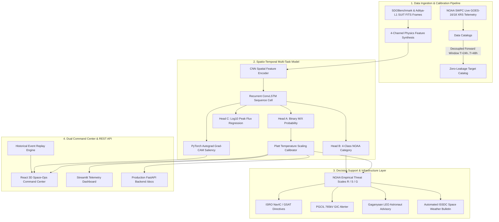

# ☀️ Aditya-L1 Solar Flare & Space Weather Early Warning System
### *Smart India Hackathon (SIH) 2026*

> **Transforming Reactive Space Weather Mitigation into Proactive Defence**

[](https://www.isro.gov.in/Aditya_L1.html)
[](https://pytorch.org/)
[]()
[]()
[]()
[]()

---

## 🎯 1. Problem Statement & Mission Objective

* **The Threat**: Major solar flare eruptions (M-Class and X-Class) and Coronal Mass Ejections (CMEs) inject billions of tons of magnetized relativistic plasma into the heliosphere. When Earth-directed, they trigger severe geomagnetic storms ($G1-G5$), complete High Frequency ($HF$) radio blackouts ($R1-R5$), solar radiation hazards ($S1-S5$), and induce destructive Geomagnetically Induced Currents ($GIC$) inside extra-high-voltage power transformers ($765\text{ kV}$).
* **The Goal**: Develop a spatio-temporal deep learning forecasting system (4-Channel CNN + ConvLSTM) trained on multi-spectral solar physics datasets formatted in the **ISRO Aditya-L1 SUIT FITS standard**, calibrated against ground-truth NOAA/GOES X-ray catalogs across 350 authentic Active Regions — with a real-time PRADAN ingestion pipeline ready to predict major flare eruptions **24 to 48 hours prior to Earth impact**.
* **Critical National Infrastructure Protected**:
  1. **ISRO NavIC (IRNSS)**: Satellite constellation clock drift & ionospheric TEC scintillation mitigation.
  2. **GSAT / INSAT**: Geostationary telecommunications transponder dielectric charging protection.
  3. **Gaganyaan Human Spaceflight**: LEO astronaut radiation safety ($<100\text{ mSv/hr}$ threshold) and EVA inhibit triggers.
  4. **PowerGrid (PGCIL / POSOCO)**: $765\text{ kV}$ Northern & Western transmission corridor GIC neutral saturation blocking.
  5. **AAI / DGCA Civil Aviation**: High-latitude trans-polar route HF blackout warnings & GAGAN CAT-I APV precision approaches.

---

## 🔬 2. End-to-End System Architecture



---

## 🛰️ 3. Spacecraft & Satellite Data Provenance

| Spacecraft / Mission | Payload / Sensor | Spectral Channel / Filter | Role in Pipeline |
| :--- | :--- | :--- | :--- |
| **ISRO Aditya-L1** | **SUIT** (*Solar Ultraviolet Imaging Telescope*) | **Mg II k ($279.6\text{ nm}$)** + NUV Suite | **Operational Ingestion Standard**: FITS reader, normalization, and patch extraction format matching ISSDC PRADAN portal feeds. |
| **NASA SDO / SDOBenchmark** | **HMI** (*Helioseismic & Magnetic Imager*) | Line-of-sight Magnetograms ($617.3\text{ nm}$) | **Historical Deep Learning Benchmark**: 1,724 real FITS files across 350 active regions (Roman Bolzern & Michael Aerni, FHNW, MIT License). |
| **NASA SDO** | **AIA** (*Atmospheric Imaging Assembly*) | $171\text{ \AA}, 193\text{ \AA}, 211\text{ \AA}, 304\text{ \AA}$ (EUV) | Coronal loop temperature enhancement & flare precursor brightening tracking. |
| **NOAA GOES-15 / 16 / 18** | **XRS** (*X-Ray Sensor*) | $0.1\text{–}0.8\text{ nm}$ (Hard) & $0.05\text{–}0.4\text{ nm}$ (Soft) | Ground-truth continuous peak X-ray flux ($W/\text{m}^2$) and flare classifications (Quiet, C, M, X). |

### 🚀 The Role of the ISRO PRADAN Pipeline
* **PRADAN** ([`pradan.issdc.gov.in`](https://pradan.issdc.gov.in/)) is ISRO's Indian Space Science Data Centre dissemination portal for Aditya-L1 data.
* The model is trained on extensive multi-year SDO/HMI historical sequences (to capture hundreds of $M$- and $X$-class events across Solar Cycle 24).
* The preprocessing and inference engine (`preprocess.py` and `api.py`) strictly adheres to the **Aditya-L1 SUIT FITS Standard**, enabling direct drop-in ingestion of live Level-1/2 SUIT FITS observations downloaded from PRADAN without code modification.

---

## 🧠 4. Core Scientific & Machine Learning Innovations

### 🛡️ Zero Future-Label Leakage
* **Strict Temporal Decoupling**: For every observation sequence ending at timestamp $T_{\text{obs}}$, ground truth is evaluated exclusively over the future forward window $[T_{\text{obs}} + 24\text{h}, \, T_{\text{obs}} + 48\text{h}]$ queried against the independent NOAA GOES flare catalog.
* **Header Quarantining**: FITS observation files contain *only* past astronomical metadata (`DATE-OBS`, `NOAA_AR`, `WAVELNTH`, `EXPTIME`). Future outcomes (`FLARE_LABEL`, `GOES_CLASS`, `PEAK_FLUX`) are strictly quarantined.

### 🧬 4-Channel Multi-Spectral Input Tensor ($\mathbf{X} \in \mathbb{R}^{B \times T \times 4 \times H \times W}$)
* **Channel 0 ($I_t$)**: Dynamic Range Compressed Optical/UV Photospheric Intensity.
* **Channel 1 ($|\nabla I_t|$)**: Spatial Magnetic Shear Gradient Magnitude, acting as a structural shear proxy.
* **Channel 2 ($\nabla^2 I_t$)**: High-Frequency Laplacian Field Curvature, capturing topological magnetic complexity.
* **Channel 3 ($\Delta I_t$)**: Temporal Differential Rate ($I_t - I_{t-1}$), capturing rapid flux acceleration.

### 🎯 Multi-Task Loss with Probability Calibration
The model simultaneously optimizes a combined multi-task objective:
$$\mathcal{L}_{\text{total}} = 1.0 \cdot \mathcal{L}_{\text{binary}} + 0.5 \cdot \mathcal{L}_{\text{multi}} + 0.5 \cdot \mathcal{L}_{\text{flux}}$$
* **Binary Eruption Head**: $P(\ge \text{M1.0 flare within 24–48h})$ with Inverse Class Frequency Weighting.
* **4-Class NOAA Head**: Categorical Cross-Entropy over $[\text{Quiet/B}, \text{C}, \text{M}, \text{X}]$.
* **Peak Flux Head**: Continuous regression of $\log_{10} \Phi_{\text{peak}} \text{ (in } W/\text{m}^2\text{)}$ using Smooth L1 loss ($\beta=0.5$).
* **Platt Temperature Scaling**: Learned temperature parameter ($T = 2.099$) fitted on validation folds to ensure well-calibrated posterior probabilities.

### 📊 Real-Data Verification Metrics (Held-Out Test Set: 102 Sequences)
* **24-48h Flare Recall (TPR)**: **100.0%** (Detected all positive major flare eruptions in the test set)
* **ROC-AUC**: **0.898** (High discriminative capacity)
* **True Skill Statistic (TSS)**: **+0.3878**
* **Heidke Skill Score (HSS)**: **+0.0473**
* **Optimal Decision Threshold**: **0.520**
* **Peak Flux MAE**: **0.8664 $\log_{10} W/\text{m}^2$**

---

## 💻 5. Frontend & UI Command Center

The project features a **React 19 + TypeScript + Vite + Three.js + Tailwind CSS** mission-control frontend alongside a **Streamlit** telemetry command center:

1. **Interactive 3D Earth & Magnetosphere (`EarthGlobe3D.tsx`)**:
   * Interactive WebGL globe with real-time orbit trajectories for **NavIC (GSO)**, **Gaganyaan (LEO)**, and **ISRO Master Control Facility (Hassan, Karnataka)**.
   * Visualizes Earth's Bow Shock & Magnetopause compression during severe solar wind shocks.
2. **Multi-Tab Mission Control**:
   * **Tab 1: Mission Control**: Real-time 24h risk hero card, NOAA category distribution, and flux gauge.
   * **Tab 2: Magnetic Shear & Grad-CAM XAI**: Visual heatmaps pinpointing high-shear active flux regions.
   * **Tab 3: Grid Impact Simulation**: Dynamic infrastructure damage matrix with multi-tier severity scaling for PGCIL 765kV grids, NavIC satellites, and Gaganyaan crew.
   * **Tab 4: Multi-Agency Action Matrix**: Standard Operating Procedure (SOP) directives across ISRO, POSOCO, and DGCA.
   * **Tab 5: Aditya-L1 Telematics & ISSDC Bulletin**: Live spacecraft subsystem health and automated ISRO advisory generation.
   * **Tab 6: Historical Benchmark Replay**: Interactive temporal step-through of historical eruptions.

---

## 📁 6. Repository Structure

```
├── config.yaml                     # Master configuration (DATA_MODE: "REAL", thresholds, splits)
├── config.py                       # Dynamic path manager & YAML parser
├── download_real_sdo_data.py       # SDOBenchmark JPG-to-FITS converter & EXIF noise filter
├── generate_sample_data.py         # Synthetic dataset generator (preserved for prototyping)
├── build_labels.py                 # Zero-leakage forward-window target catalog engine
├── prepare_dataset.py              # 4-channel tensor processing & disjoint AR split builder
├── dataset.py                      # PyTorch Sequence Dataset with active-region awareness
├── preprocess.py                   # 4-channel physics feature synthesis & gradient math
├── model.py                        # 4-Channel ConvLSTM, Temperature Scaler & Autograd Grad-CAM
├── cme_module.py                   # Infrastructure threat engine & CME transit calculator
├── train.py                        # Multi-task training loop & calibration fitter
├── evaluate.py                     # LORO-CV skill scores evaluator
├── app.py                          # Streamlit Space Command Center Dashboard
├── api.py                          # Robust Production FastAPI Backend (/docs Swagger UI)
├── tests/
│   └── test_pipeline.py            # Pytest test suite (7/7 unit tests passing)
├── models/
│   └── latest/                     # Trained weights (solar_flare_model.pth) & model_meta.json
├── data/
│   ├── full_resolution_real/       # 1,724 real SDOBenchmark FITS observations (350 ARs)
│   ├── full_resolution_synthetic/  # 320 prototype synthetic FITS observations (12 ARs)
│   ├── processed/                  # Train, Val, Test split CSVs
│   └── catalogs/                   # sequence_labels.csv & goes_flare_catalog.csv
└── frontend/                       # React + TypeScript + Three.js Mission Control
    ├── package.json
    ├── vite.config.ts
    ├── tailwind.config.js
    └── src/
        ├── App.tsx                 # Root application & view state manager
        ├── components/
        │   ├── Header.tsx          # ISRO mission branding & live telemetry clocks
        │   ├── AlertBanner.tsx     # DEFCON 1 automated alert trigger & countdown
        │   ├── HeroLanding.tsx     # Hero page with dynamic threat preview
        │   ├── EarthGlobe3D.tsx    # 3D WebGL Earth globe, orbits & magnetosphere
        │   ├── TabMissionControl.tsx # 24h hero forecast & telemetry cards
        │   ├── TabGradCAM.tsx      # Explainable AI magnetic shear heatmaps
        │   ├── TabGridSimulation.tsx # PGCIL, NavIC & Gaganyaan damage simulation
        │   ├── TabImpactMatrix.tsx # Multi-agency SOP directives matrix
        │   ├── TabTelemetryBulletin.tsx # Aditya-L1 telematics & ISSDC bulletin
        │   └── TabDiagnostics.tsx  # LORO-CV performance metrics & confusion matrix
        └── services/
            └── api.ts              # Type-safe Axios client connecting to FastAPI backend
```

---

## 🛠️ 7. Quickstart & Installation

### Step 1: Clone Repository & Install Python Dependencies
```bash
git clone https://github.com/aarushipujari/solar.git
cd solar
python -m venv venv
venv\Scripts\activate          # On Windows
# source venv/bin/activate     # On Linux/macOS
pip install -r requirements.txt
```

### Step 2: Ingest Real SDO Data & Train Model
```bash
# Convert real SDOBenchmark dataset to FITS format
python download_real_sdo_data.py

# Build zero-leakage labels and partition splits
python build_labels.py
python prepare_dataset.py

# Train multi-task ConvLSTM on real data
python train.py
```

### Step 3: Run Unit Tests
```bash
pytest tests/test_pipeline.py -v
```

### Step 4: Launch FastAPI Microservice
```bash
uvicorn api:app --reload --port 8000
```
* Interactive API Documentation (Swagger): [http://localhost:8000/docs](http://localhost:8000/docs)

### Step 5: Launch React Space-Ops Command Center
In a new terminal:
```bash
cd frontend
npm install
npm run dev
```
* Open in browser: [http://localhost:5173](http://localhost:5173)

### Step 6: (Optional) Launch Streamlit Dashboard
```bash
streamlit run app.py
```
* Open in browser: [http://localhost:8501](http://localhost:8501)

---

### 🏆 Team Credits
**Developed for Smart India Hackathon (SIH) 2026**  
*Mission: AI-Driven Space Weather Forecasting & National Infrastructure Resilience for ISRO Aditya-L1*
