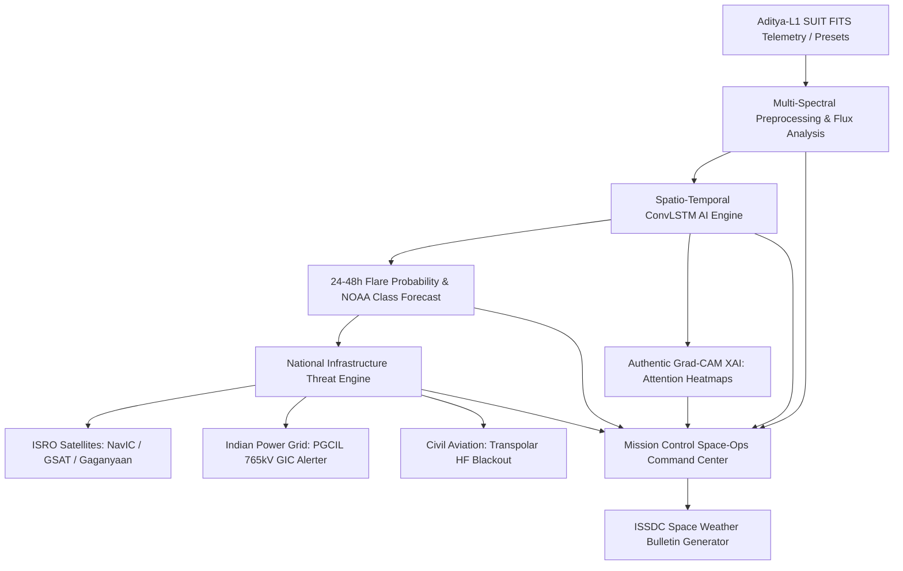

# ☀️ Aditya-L1 Solar Flare & Space Weather Warning System
### *Smart India Hackathon (SIH) 2026*

> **Transforming Reactive Mitigation into Proactive Defence**

[](https://www.isro.gov.in/Aditya_L1.html)
[](https://pytorch.org/)
[]()
[](https://streamlit.io/)

---

## 🎯 Problem Statement & Mission Objective

* **The Problem**: Geomagnetic storms and Coronal Mass Ejections (CMEs) can fry satellite electronics, disrupt GPS signals (NavIC), and knock out electrical power grids on Earth (PGCIL).
* **The Challenge**: Train deep learning models on multi-spectral solar imagery (specifically the pioneering **ISRO Aditya-L1 SUIT** dataset) to forecast solar flares **24 to 48 hours prior to impact**.
* **Our Mission**: To protect critical satellite communication, global navigation networks, and power infrastructure from destructive geomagnetic storms and CMEs by providing predictive forecasts 24–48 hours in advance—transforming reactive mitigation into proactive defence.

---

## 📌 Key Architectural Pillars



### 1. 🛰️ Authentic Multi-Spectral SUIT Pipeline
* Processes FITS telemetry from ISRO's **Solar Ultraviolet Imaging Telescope (SUIT)** onboard Aditya-L1.
* Extracts limb-darkened solar disks, dynamic Active Region patches, and joins FITS timestamps with the **GOES X-ray flare event catalog** ($C$, $M$, $X$ classes).

### 2. 🧠 Spatio-Temporal Deep Learning (CNN + ConvLSTM)
* Combines **2D CNN spatial encoders** with a **recurrent ConvLSTM cell** to track the temporal evolution of magnetic shear across time steps $T-3, T-2, T-1, T-0$.
* Outputs 24–48 hour eruption probability and estimated NOAA flare classification.

### 3. 🔬 Authentic PyTorch Grad-CAM (XAI)
* Computes live mathematical gradient-weighted class activations:
  $$\alpha_k^{(t)} = \frac{1}{Z} \sum_{i=1}^H \sum_{j=1}^W \frac{\partial y^{\text{flare}}}{\partial A_{k,i,j}^{(t)}}, \quad L_{\text{Grad-CAM}}^{(t)} = \text{ReLU}\left(\sum_k \alpha_k^{(t)} A_k^{(t)}\right)$$
* Explains to space operations controllers exactly which magnetic loops and flux shear lines triggered the model's warning.

### 4. 🛡️ National Assets Protection Matrix
* **ISRO NavIC (IRNSS)**: L5/S-band ionospheric delay compensation & atomic clock thermal drift safing.
* **GSAT/INSAT Geostationary Telecom**: Surface charging hazard mitigation and transponder surge protection.
* **Gaganyaan Human Spaceflight**: Astronaut LEO Radiation Dose Rate ($mSv/h$) & Extravehicular Activity (EVA) GO / NO-GO status.
* **Indian Power Grid (PGCIL / POSOCO)**: Regional Geomagnetically Induced Currents (GIC) threat rating across 765kV/400kV transformer substations.
* **Civil Aviation (DGCA)**: Trans-polar HF radio blackout durations and airport approach GPS degradation warnings.

---

## 🛠️ Quickstart Installation

1. **Clone the Repository**:
   ```bash
   git clone https://github.com/your-username/solar-flare-warning-system.git
   cd solar-flare-warning-system
   ```

2. **Install Dependencies**:
   ```bash
   pip install -r requirements.txt
   ```

3. **Generate Scenarios & GOES Catalog**:
   ```bash
   python generate_sample_data.py
   ```

4. **(Optional) Train DL Model**:
   ```bash
   python train.py
   ```

5. **Launch the Mission Command Center**:
   ```bash
   streamlit run app.py
   ```

---

## 📁 Repository Structure

```
├── app.py                  # Streamlit Space Command Center UI (5 Tabs)
├── model.py                # CNN + ConvLSTM Architecture & PyTorch Grad-CAM Engine
├── preprocess.py           # Multi-spectral colormaps, FITS cleaning, Sobel flux gradients
├── dataset.py              # FITS header parser & GOES catalog temporal joining
├── generate_sample_data.py # Aditya-L1 SUIT synthetic scenario generator & GOES catalog
├── train.py                # Model training and checkpoint saving
├── config.py               # Dynamic project directory paths & parameters
├── requirements.txt        # Python dependency manifest
└── data/                   # FITS data, scenarios, model weights, and GOES catalog
```

---

**Developed for Smart India Hackathon (SIH) 2026**
