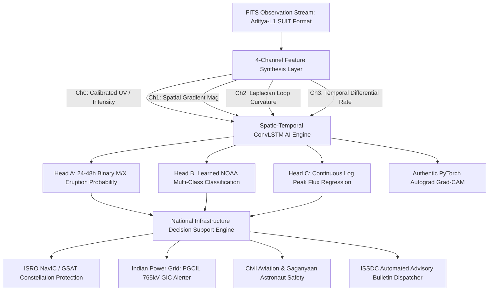

# ☀️ Aditya-L1 Solar Flare & Space Weather Early Warning System
### *Smart India Hackathon (SIH) 2026*

> **Transforming Reactive Mitigation into Proactive Defence**

[](https://www.isro.gov.in/Aditya_L1.html)
[](https://pytorch.org/)
[]()
[]()

---

## 🎯 Problem Statement & Objective

* **The Problem**: Geomagnetic storms and Coronal Mass Ejections (CMEs) can fry satellite electronics, disrupt GPS signals (NavIC), and knock out electrical power grids on Earth (PGCIL).
* **The Challenge**: Train deep learning models on multi-spectral solar imagery (specifically the pioneering **ISRO Aditya-L1 SUIT** dataset format) to forecast solar flares **24 to 48 hours prior to Earth impact**.
* **Our Mission**: To protect critical satellite communication, global navigation networks, and power infrastructure by providing predictive forecasts 24–48 hours in advance—transforming reactive mitigation into proactive defence.

---

## 🔬 System Architecture & Scientific Methodology



---

## 🚀 Key Technical Highlights

### 1. 🛰️ Zero-Leakage 24–48 Hour Forward Target Window Formulation
For any observation sequence ending at timestamp $T_{\text{obs}}$:
* **Target Window**: $[T_{\text{obs}} + 24\text{ hours}, \, T_{\text{obs}} + 48\text{ hours}]$
* **Target Verification**: Evaluated against the independent GOES X-ray flare event catalog ($C$, $M$, $X$ classes).
* **Zero Label Leakage**: FITS headers contain pure observational metadata (`DATE-OBS`, `NOAA_AR`, `WAVELNTH`, `EXPTIME`). Future flare information is strictly decoupled from input features.

### 2. 🧠 4-Channel Multi-Spectral & Topological Input Tensor ($[B, T, 4, H, W]$)
Instead of feeding single-channel grayscale patches, the spatial encoder receives a 4-channel tensor:
* **Channel 0**: Dynamic Range Compressed Optical/UV Intensity ($I_t$).
* **Channel 1**: Spatial Flux Gradient Magnitude ($|\nabla I_t|$), representing magnetic shear lines.
* **Channel 2**: High-Frequency Laplacian Curvature ($\nabla^2 I_t$), capturing active magnetic loop topologies.
* **Channel 3**: Temporal Differential Rate ($\Delta I_t = I_t - I_{t-1}$), measuring rapid flux emergence.

### 3. 🎯 Learned Multi-Task Objectives (No Hardcoded Thresholds)
The `SolarFlarePredictor` optimizes three joint loss functions:
$$\mathcal{L}_{\text{Total}} = \mathcal{L}_{\text{Binary Cross-Entropy}} + 0.5 \mathcal{L}_{\text{NOAA Multi-Class}} + 0.2 \mathcal{L}_{\text{Flux MSE}}$$
* **Binary Eruption Head**: $P(\ge \text{M1.0 flare within 24–48h})$.
* **Multi-Class NOAA Head**: Learned probability distribution over $[\text{Quiet/B}, \text{C-Class}, \text{M-Class}, \text{X-Class}]$.
* **Flux Regression Head**: Continuous estimation of peak solar X-ray flux ($\log_{10} \Phi_{\text{peak}} \text{ in W/m}^2$).

### 4. 🔬 Authentic PyTorch Autograd Grad-CAM (XAI)
* Hooks into the final convolutional layer (`encoder[3]`) using PyTorch autograd backward hooks:
  $$\alpha_k^{(t)} = \frac{1}{Z} \sum_{i=1}^H \sum_{j=1}^W \frac{\partial y^{\text{flare}}}{\partial A_{k,i,j}^{(t)}}, \quad L_{\text{Grad-CAM}}^{(t)} = \text{ReLU}\left(\sum_k \alpha_k^{(t)} A_k^{(t)}\right)$$
* Explains to operators which spatial features and active regions directly influenced the model's forecast.

### 5. 📊 Space-Weather Verification & Benchmark Metrics
Evaluated on **strictly chronological, held-out active region test sets** (70% Train, 15% Val, 15% Test):
* **True Skill Statistic (TSS)**: $\text{TSS} = \text{TPR} - \text{FPR} = \text{Recall} - \text{False Alarm Rate}$ *(Gold standard in solar flare forecasting)*.
* **Heidke Skill Score (HSS)**: Skill relative to random chance.
* **F1-Score, Precision, Recall, and ROC-AUC**.

### 6. 🛡️ National Assets Decision Support Engine
Translates learned flare forecasts into concrete actionable defense protocols using standard NOAA Space Weather Scales:
* **ISRO NavIC (IRNSS)**: L5/S-band ionospheric delay compensation & atomic clock drift protection.
* **GSAT/INSAT Geostationary Telecom**: Surface charging hazard mitigation and transponder surge protection.
* **Gaganyaan Human Spaceflight**: Astronaut LEO Radiation Hazard Index & EVA GO / NO-GO advisories.
* **Indian Power Grid (PGCIL / POSOCO)**: 765kV/400kV transformer half-cycle core saturation and GIC mitigation alerts.
* **Civil Aviation (DGCA)**: Trans-polar HF radio blackout durations and airport approach GPS degradation warnings.

---

## 🛠️ Installation & Execution

1. **Clone the Repository**:
   ```bash
   git clone https://github.com/aarushipujari/solar.git
   cd solar
   ```

2. **Install Dependencies**:
   ```bash
   pip install -r requirements.txt
   ```

3. **Generate Dataset & Scenarios**:
   ```bash
   python generate_sample_data.py
   ```

4. **Train Multi-Task Model & Evaluate Skill Scores**:
   ```bash
   python train.py
   ```

5. **Launch the Streamlit Space Command Center**:
   ```bash
   streamlit run app.py
   ```

6. **Launch the FastAPI Production Microservice**:
   ```bash
   uvicorn api:app --reload --port 8000
   ```
   * Interactive Swagger API Documentation: [http://localhost:8000/docs](http://localhost:8000/docs)

---

## 📁 Repository Structure

```
├── app.py                  # Streamlit Space Command Center UI (6 Tabs)
├── api.py                  # Production-Grade FastAPI Backend with Swagger /docs
├── model.py                # 4-Channel Multi-Task ConvLSTM Model & Autograd Grad-CAM
├── preprocess.py           # 4-Channel Feature Synthesis & Optical Proxy Functions
├── dataset.py              # Zero-Leakage 24-48h Forward Target Generator & Chronological Splits
├── generate_sample_data.py # Multi-Region Historical FITS Dataset & GOES Event Catalog
├── evaluate.py             # Space-Weather Verification Engine (TSS, HSS, F1, ROC-AUC)
├── train.py                # Multi-Task Training Loop & Chronological Validation
├── config.py               # Dynamic Project Paths & Pipeline Parameters
├── packages.txt            # System dependencies (libgl1, libglib) for cloud deployment
├── requirements.txt        # Python dependency manifest (CPU PyTorch optimized)
└── data/                   # FITS observations, GOES catalog, and model checkpoints
```

---

**Developed for Smart India Hackathon (SIH) 2026**
